# em-calibrator postprocessor
This tool is a gcode post-processor that will create a gradient of flow ratios on the top infill layer only.

## Warning
Use at your own risk, stay close to the reset button if anything goes wrong. I am not responsible if your printer releases it's magic smoke.

## Installation
There is no installer for this post-processor, it consists of a single file command-line utility.
1. Download the latest release and unzip the file
2. Copy the command-line utility appropriate for your platform (Windows, Mac, Linux) to a folder of your choice.
3. If your are on Linux or Mac, you need to make the file executable by issues `sudo chmod +x em-calibrator`.

## Usage
### Manually
1. In the terminal execute the tool `em-calibrator.exe` in Windows or `./em-calibrator` on Mac or Linux.
2. An help message will indicate how the tool works
```
em-calibrator
Copyright 2022 (c) Daniel Valadas

ERROR(S):
  Required option 'i, input-file' is missing.
  Required option 'min-flow' is missing.
  Required option 'max-flow' is missing.

  -v, --verbose        (Default: false) Set output to verbose messages.

  -i, --input-file     Required. Input file to be processed.

  --min-flow           Required. The minimum flow multiplier to use in percentage.

  --max-flow           Required. The maximum flow multiplier to use in percentage.

  -o, --output-file    Output file to be written.

  --help               Display this help screen.

  --version            Display version information.
```

One example usage:
```
em-calibrator -i input.gcode --min-flow 80 --max-flow 120 -o output.gcode
```

### From SuperSlicer as a post-processor
1. In SuperSlicer, go to `Print Settings` > `Output options` > `Post-processing scripts`
2. Enter the full path to the utility and the required parameters like so:
   ```D:\em-calibrator-post-processor\em-calibrator.exe -v --min-flow 50 --max-flow 200 -i``
   But replace the path for where you unzipped the file and change `50` and `200` for the range of values you want to test.
   Make sure you end the command with `-i` for the input file as SuperSlicer will append the exported file at the end of the script.
3. When you are done with calibration, don't forget to remove the script from your print settings.

## Calibration Process
The process was only tested with SuperSlicer for now, but I am open to improvements if others want to help.

Since this only affects the very top layer infill we are not too worried about underextrusion or overextrusion so we can start with large values like:
50-200 %

1. Make sure you did some basic EM calibration before this process. This is to fine-tune the looks of the top layer only. Also start with a top layer flow of 100% to make calculations easier from results.
2. Add a cube to your models (right-click then add object).
3. 
4. Scale the cube to a size that will allow you to at least reach your normal top speed for about 50% of the object. Maybe 50x50mm or 100x100mm depending on your situation
5. We do not need many bottom layers, you can reduce that to 1 or 2 just to make sure we have good bed adhesion.
6. We want to to use the normal amount of top layers that would be used with your print settings (or more).
7. Scale the z size so that you have some sparse infill layers (1-2 is enough). This is just to prevent first layer issues to propagate to the top layer.
8. Slice your model and save the gcode. The post-processor will adjust the result to print a top gradient of the entered values.
9. Adjust the values in `Print Settings` > `Output Options` > `Post-processing scripts` for --min-flow and --max-flow as per your results.
10. Inspect the results, rinse and repeat with a smaller range of values until satisfied (steps 9-10).
11. When the range is so small that you can't see any difference anymore, take the average value and save that into `Top Layer Flow` (Don't forget to remove the post-processor script before saving your profile).

## Examples
### First print [50% - 200%]
Measure the result with a ruler or calipers, we can see that from 0-15mm we have obvious underextrusion.
From 35-50mm we have obvious overextrusion.
But we still have a large range where our perfectly looking value resides.
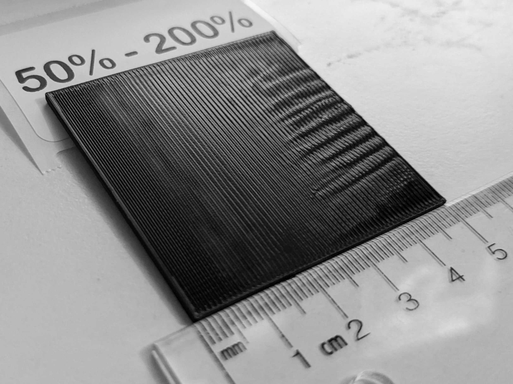

Let's use this formula to find our new min-max flows (you can also download [this excel spreadsheet](Calculator.xlsx) to help with the math):

`newMinFlow = oldMinFlow + ((oldMaxFlow - oldMinFlow) * (measuredMM / squareSize))`

`newMinFlow = 50 + ((200-50) * (15 / 50)))`

`newMinFlow = 50 + (150 * 0.3)`

`newMinFlow = 50 + 45`

`newMinFlow = 95`

And for our max-flow:

`newMaxFlow = oldMinFlow + ((oldMaxFlow - oldMinFlow) * (measuredMM / squareSize))`

`newMaxFlow = 50 + ((200-50) * (35 / 50)))`

`newMaxFlow = 50 + (150 * 0.7)`

`newMaxFlow = 50 + 105`

`newMaxFlow = 155`

### Second print [95% - 155%]
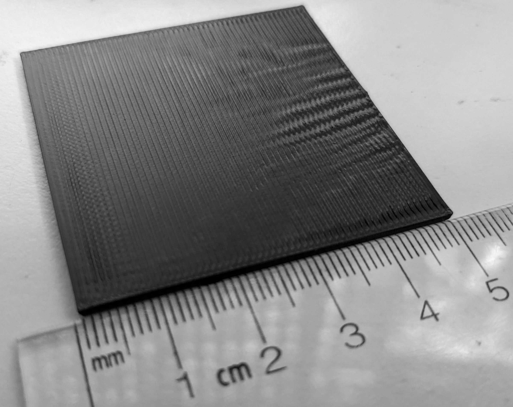

On this one there is way more overextrusion than underextrusion,
so I decide to use 2mm and 35mm for the next step, which ends up being
97.4% - 137%

### Third print [97.4% - 137%]
I now feel like there is no longer much underextrusion but some overextrusion and a choice for the surface finish
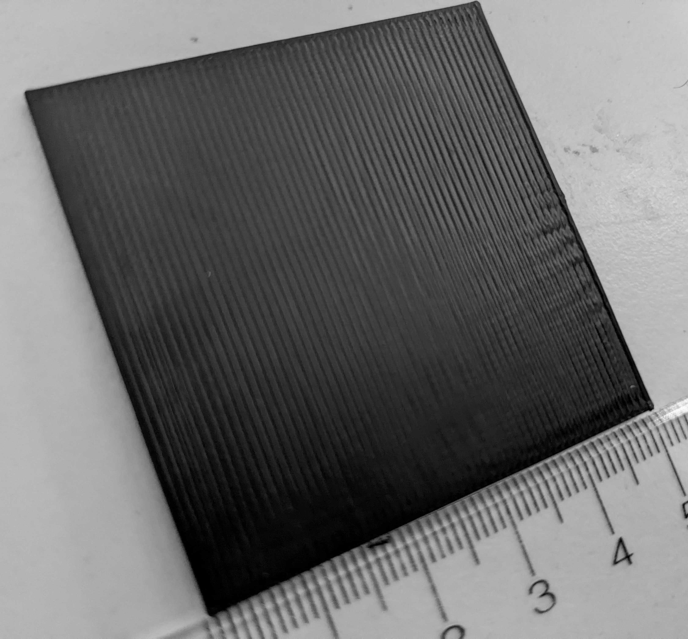

It is hard to describe in pictures but in person I see that the area very near the left feels
smoother than the center, so I don't want to remove too much of the low values as I feel the sweat spot will
end up close to that minimum value than the maximum.

I put the test part under the miscroscope and it feels like the circled area is where I want to be.
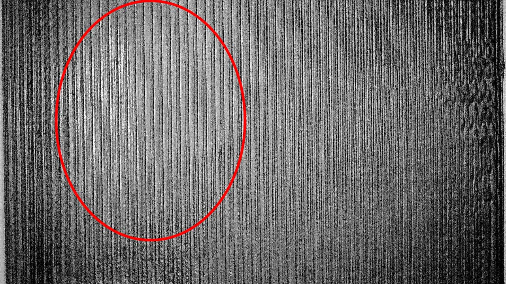

I decided to discard the parts left of 1mm and right of 35mm and let's reprint with those calculations

### Forth print [98.192% - 125.12%]
Still feels like the sweat spot is towards the left, so I don't want to remove too much of the low values.
I decided to exclude the first 1mm and everthing after 35mm
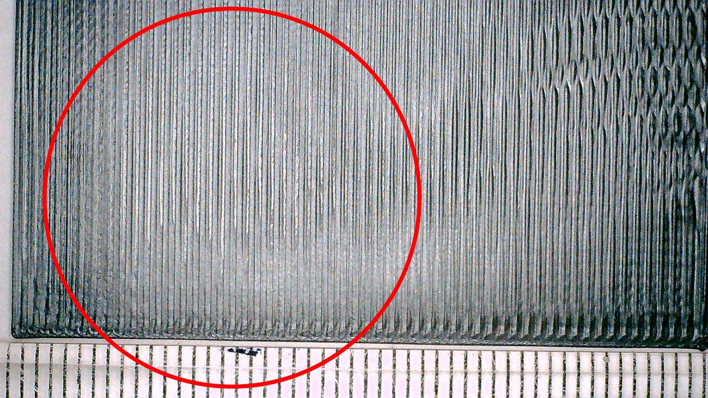

### Fifth print [98.73056% - 117.0416%]
On this one, I decide to discard before 3mm and after 25mm
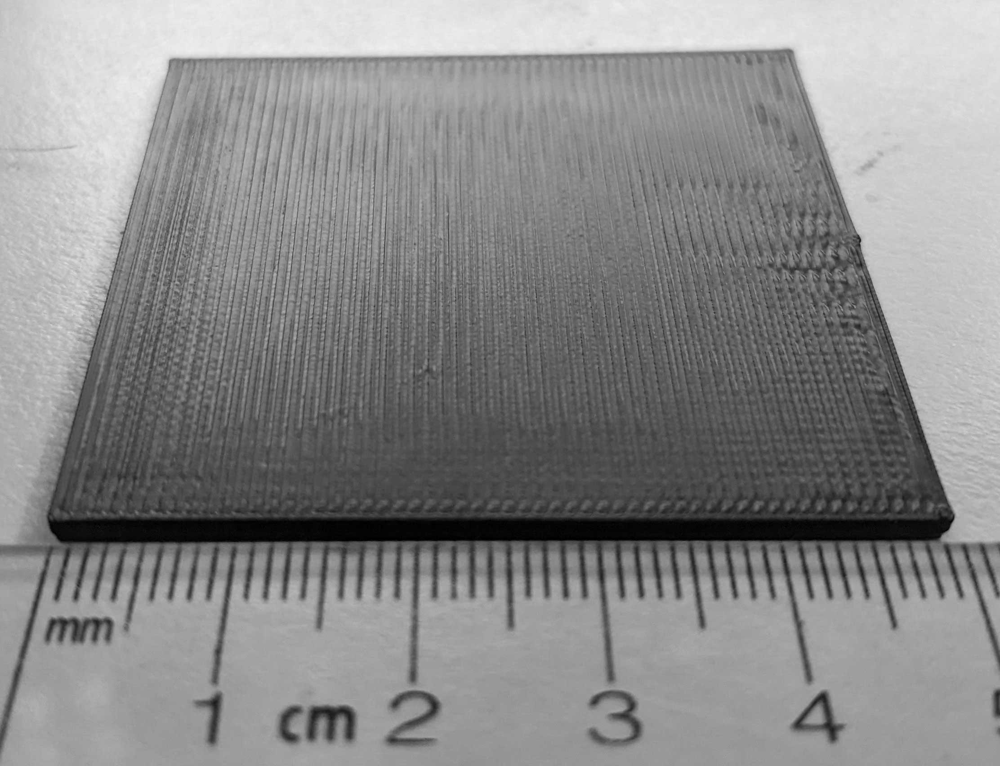

### Sixth print [98.82922% - 107.88608%]
Most of this text looks right except the very first and last 5mm, our sweat stop should be right in the middle maybe, but let's do one more to see if we get a whole perfect test.
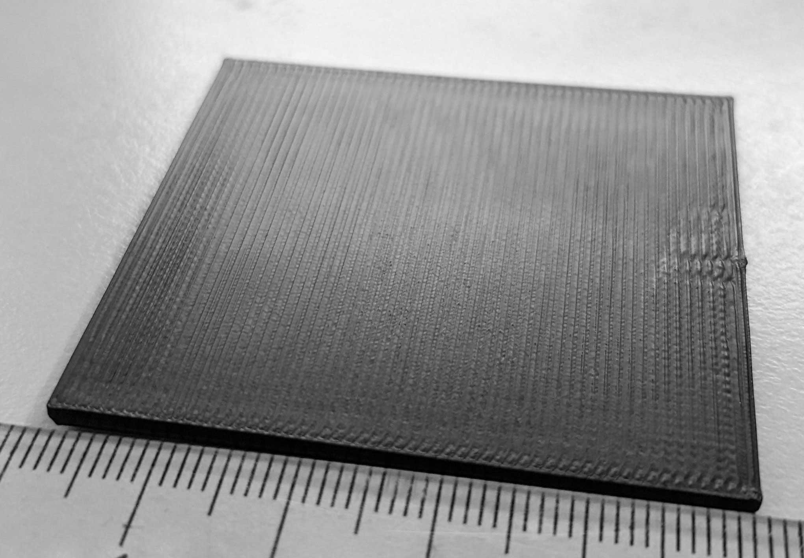

### Seventh print [100.31263% - 105.46902%]
I now see a nice patch near the center that is starting to look perfect.
I am discarding before 10mm and after 40mm to zoom in on that area.
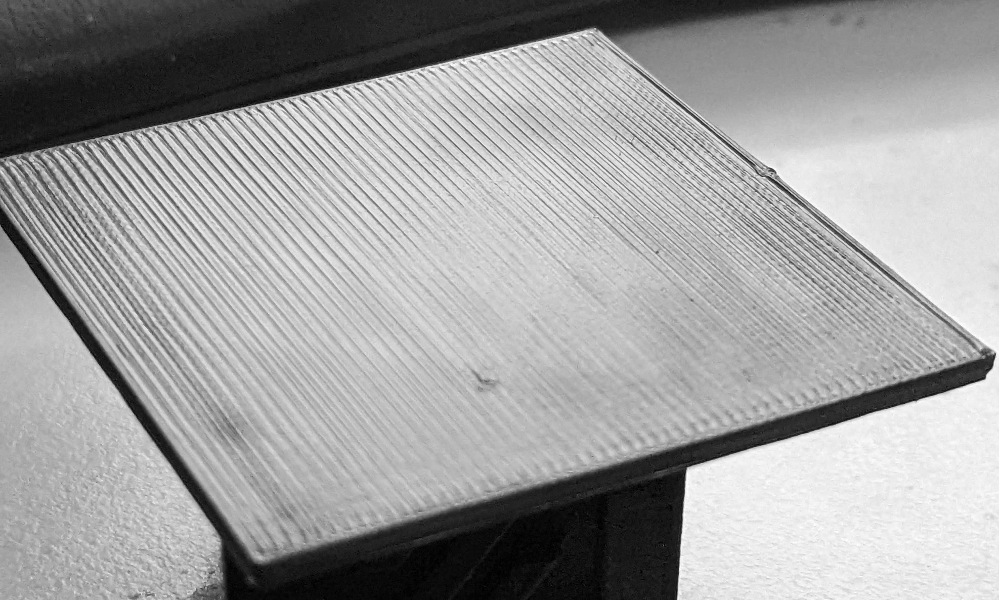

### Eighth print [101.34391% - 104.43774%]
The smooth path as increased but I can still see differences, so zooming in again
and discarding the first 8mm and the area after 30mm
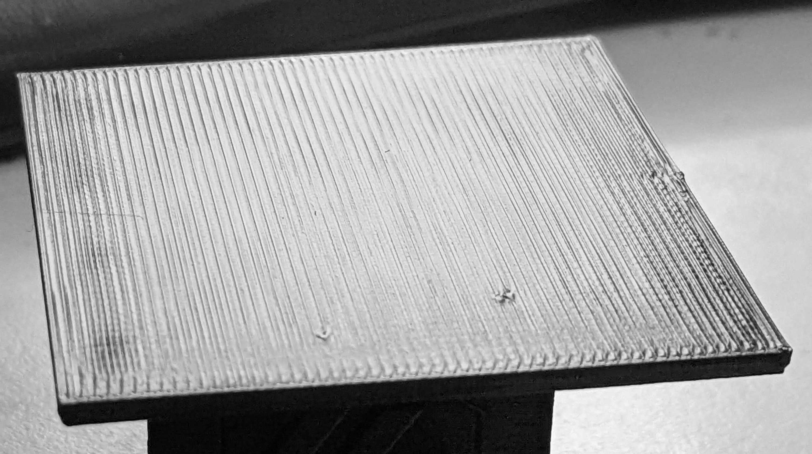

### Ninth print [102.45769% - 103.50959%]
It is hard to see in a picture but moving the test part at angles towards lights
I can see still nice and less nice areas, I decided to go with 18mm and 35mm on this one.
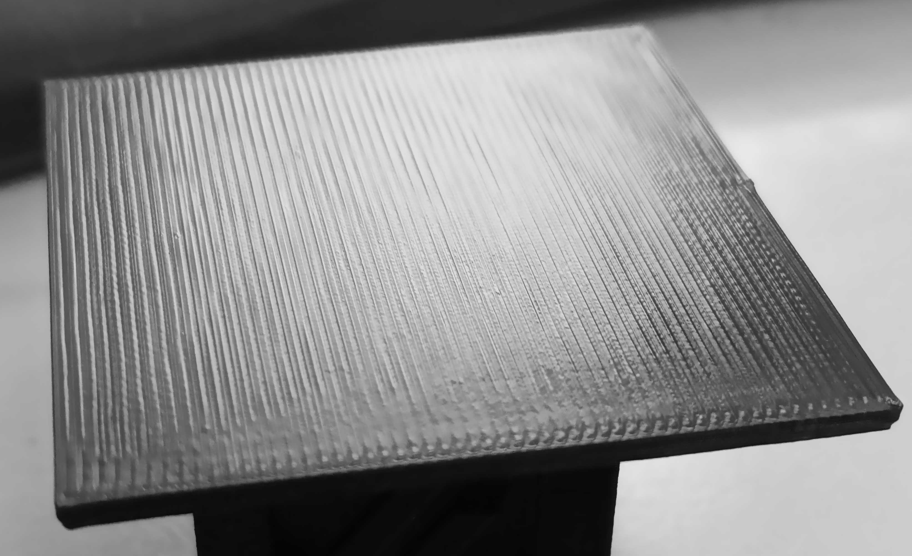

### Tenth print [102.83637% - 103.19402%]
Similar results here, I know the first and last 10mm are not right butthe middle looks similar enough to be uncertain, so chopping the first and last 10mm and trying again.
At this stage I also notice that the ends of lines look better than the middles, so trying to bump my Pressure Advance a tiny little bit and we will see if that improves.
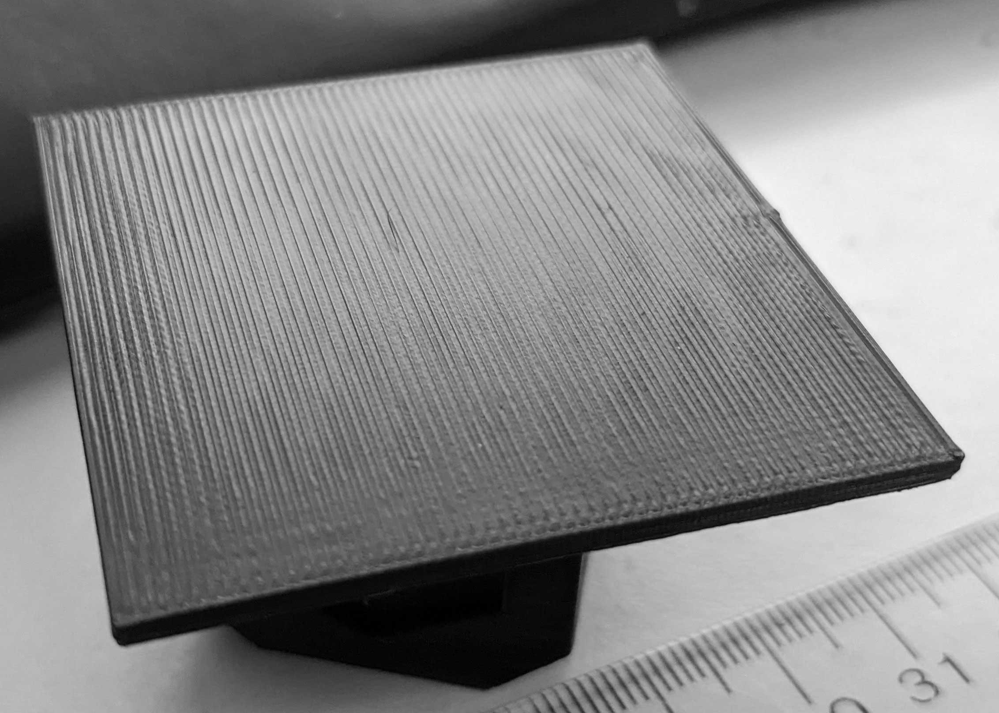

### Eleventh print [102.9079% - 103.12249%]
Increasing Pressure advance by 0.001 (to 0.044) did help bring the look of
the line ends longer towards the line centers but not completely, maybe half way.
I still see a good/bad situation so I am discarding 10mm and 25mm points.
And bumping pressure advance to 0.045, I could not see the effects of PA as clearly before I got into a much more precise flow value like we have now.
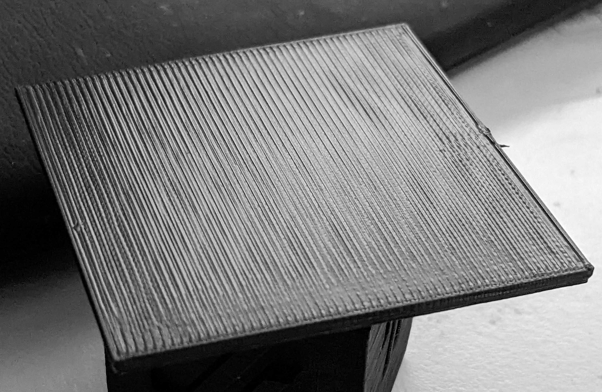

### Twelvth print [102.95082% - 103.05811%]
Pictures with on purpose harsh lightin makes it look worst than reality but this test looks almost all right.
Moving the part towards a light still shows me that from 7mm to 20mm it looks way better than the rest of the surface, so let's use those values.

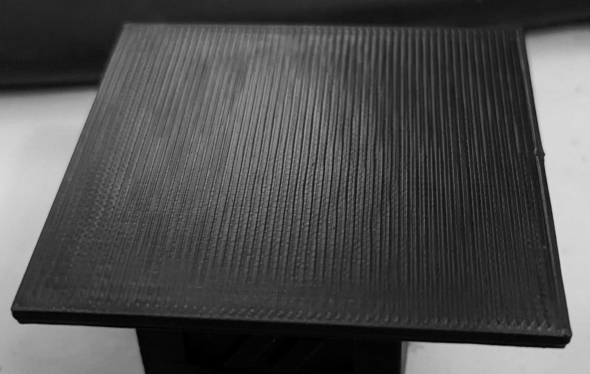

### Thirteenth print [102.96584% - 102.99374%]
The range on this card is about only 0.03%, we are getting very close to our perfect value.
The majority of the card looks right, but I can still see that the line ends have a bit more material than the center.
I will discard 10mm from each side and bump my PA another 0.001 to 0.046.

 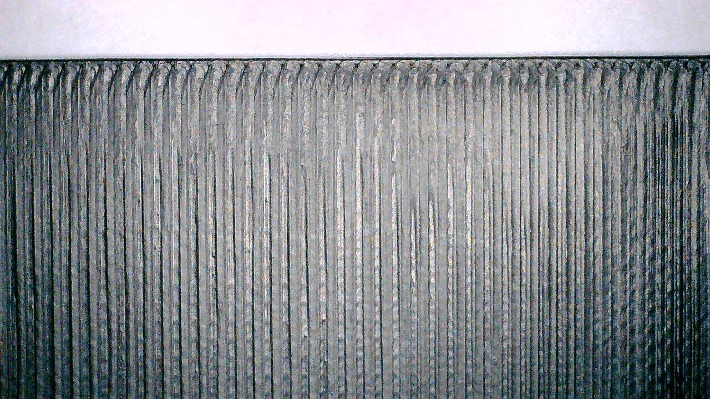

### Fourteenth print [102.97142% - 102.98816%]
The whole test part now looks about the same to me on the entire surface.
I will use a rounded average of the last two values (102.98). This value can
be applied to the top surface only (Top Solid Infill Flow) or the overall
EM can be multiplied by that value.
I decided to bump the overall EM and the part came out great. If that would have caused
overextrusion I would have instead just applied it to the top flow.

